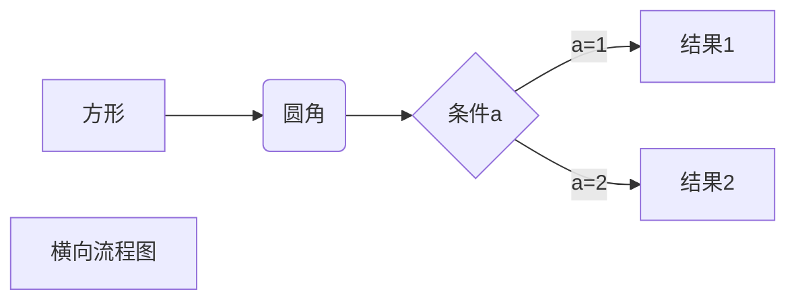
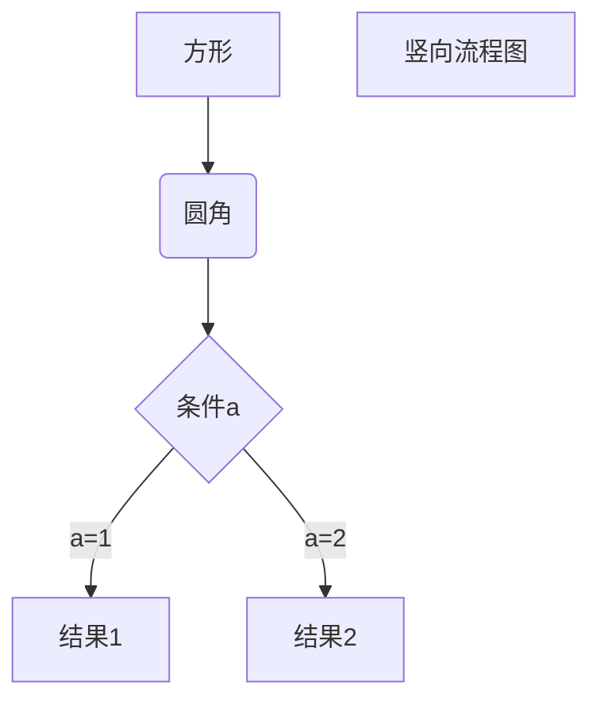
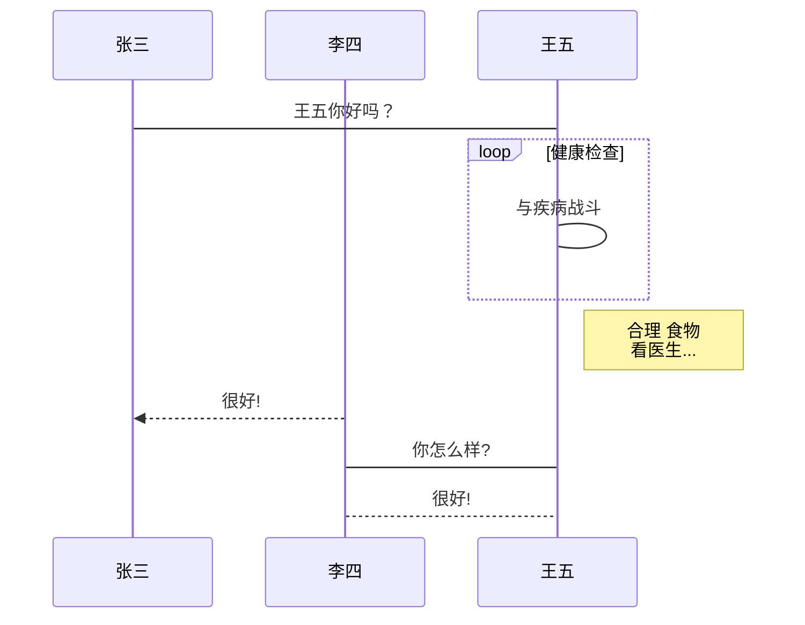
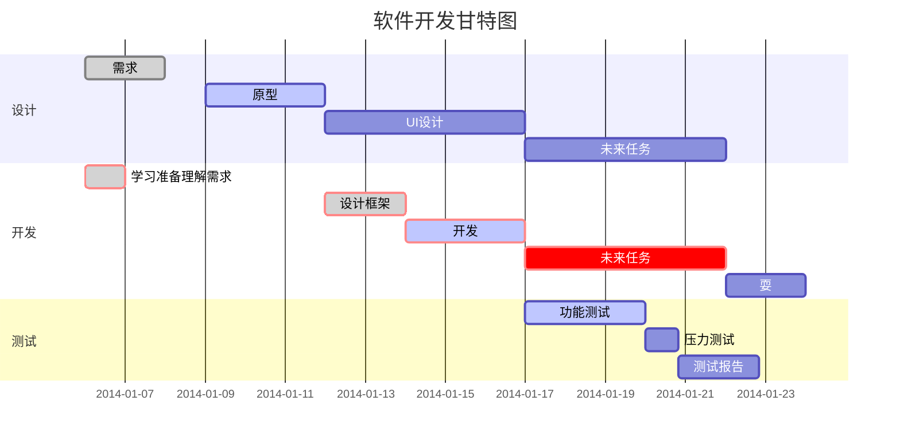

# Markdown快速入门(typora) 2020.11.04

## 代码块的用法

三个```号加代码回车即可，下面是效果

```java
//代码块语法
​```java
    
​```shell
```

##  1.c语言代码

随便复制了一个题目的答案。。。

```c
#include<stdio.h>
#include<math.h>
int main() {
  	double i;
	scanf("%lf",&i);
	if(i-(int)i>=0.5)
	{
		i++;
	}
	if(i>40)
	{
		printf("2^%.0lf",i);
		return 0;
	}//防溢出
	printf("%.0lf\n",pow(2,(int)i));
	return 0;

```


## 2、标题的用法

#空格+标题名称    （markdown的标题比word的简洁一些。。熟悉word快捷键的话我感觉速度上也差不了多少。。。

```c
//标题语法
# 一级标题
## 二级标题
### 三级标题
#### 四级标题
##### 五级标题
###### 六级标题
```

# 一级标题
## 二级标题
### 三级标题
#### 四级标题
##### 五级标题
###### 六级标题

## 3、字体设置

``` c
//加粗
**烟火不会太完美**
//代码高亮显示
==回忆烧成灰==
//删除线
~~被删除的文字~~
//斜体
*斜体内容*    
```

ps:heavy_check_mark:

ps:1st_place_medal:

What???加个注释不小心出来上面这个。。。（发现新大陆！！

ps（字体这方面markdown就比word方便太多太多了！！！

下面为效果。。。

//加粗
**烟火不会太完美**
//代码高亮显示
==回忆烧成灰==
//删除线
~~他曾说的无所谓，我怕一天一天被摧毁~~
//斜体
*斜体内容*

`printf`

## 4、引用

```c
//引用语法
>作者：陈淅
>>作者：陈淅    
>>>作者：陈淅    
```

感觉这玩意用处不大。。下面是效果。。


>作者：陈淅
>
>>作者：陈淅    
>>
>>>作者：陈淅    

## 5、分割线

```c
//分割线
---
//分割线2
***
```

这个markdown的分割线和word的操作是一样的吧。。。。


***

## 6、图片插入

```c
//在线图片/本地图片

```

没有帅照，，此处无照片。。。（图片插入这里就比word快很多了。。。不过你真的记得图片的地址和文件名吗？？23333）


## 7、超链接

```c
//超链接语法
[我的github](地址)
```

[我的github](https://github.com/Mr-Chenxii)

## 8、列表语法

```c
//无序列表
- 目录1
- 目录2
- 目录3
- 目录4
//有序列表
+ 名称
```

- 无序列表
- 目录2
- 目录3
- 目录4

+ 名称

  1.第一项

  -

  - 你的

    + 我的 

      * **他的**

        

        

## 9、表格

|      |      |      |
| ---- | ---- | ---- |
|      |      |      |
|      |      |      |
|      |      |      |

## 10、高级操作（从菜鸟上copy下来的万一用得到呢。。）

**1、横向流程图**

```
​```mermaid
graph LR
A[方形] -->B(圆角)
    B --> C{条件a}
    C -->|a=1| D[结果1]
    C -->|a=2| E[结果2]
    F[横向流程图]
​```
```



**2、竖向流程图**

```
​```mermaid
graph TD
A[方形] --> B(圆角)
    B --> C{条件a}
    C --> |a=1| D[结果1]
    C --> |a=2| E[结果2]
    F[竖向流程图]
​```
```



**3、标准流程图**

```
​```flow
st=>start: 开始框
op=>operation: 处理框
cond=>condition: 判断框(是或否?)
sub1=>subroutine: 子流程
io=>inputoutput: 输入输出框
e=>end: 结束框
st->op->cond
cond(yes)->io->e
cond(no)->sub1(right)->op
​```
```

```flow
st=>start: 开始框
op=>operation: 处理框
cond=>condition: 判断框(是或否?)
sub1=>subroutine: 子流程
io=>inputoutput: 输入输出框
e=>end: 结束框
st->op->cond
cond(yes)->io->e
cond(no)->sub1(right)->op
```

**4、UML失序图源码样例**

```
​```sequence
对象A->对象B: 对象B你好吗?（请求）
Note right of 对象B: 对象B的描述
Note left of 对象A: 对象A的描述(提示)
对象B-->对象A: 我很好(响应)
对象A->对象B: 你真的好吗？
​```
```

```sequence
对象A->对象B: 对象B你好吗?（请求）
Note right of 对象B: 对象B的描述
Note left of 对象A: 对象A的描述(提示)
对象B-->对象A: 我很好(响应)
对象A->对象B: 你真的好吗？
```

**5、UML时序图源码复杂样例**

```
​```sequence
Title: 标题：复杂使用
对象A->对象B: 对象B你好吗?（请求）
Note right of 对象B: 对象B的描述
Note left of 对象A: 对象A的描述(提示)
对象B-->对象A: 我很好(响应)
对象B->小三: 你好吗
小三-->>对象A: 对象B找我了
对象A->对象B: 你真的好吗？
Note over 小三,对象B: 我们是朋友
participant C
Note right of C: 没人陪我玩
​```
```

```sequence
Title: 标题：复杂使用
对象A->对象B: 对象B你好吗?（请求）
Note right of 对象B: 对象B的描述
Note left of 对象A: 对象A的描述(提示)
对象B-->对象A: 我很好(响应)
对象B->小三: 你好吗
小三-->>对象A: 对象B找我了
对象A->对象B: 你真的好吗？
Note over 小三,对象B: 我们是朋友
participant C
Note right of C: 没人陪我玩
```

**6、UML标准时序图样例**

~~~c

~~~


**7、甘特图样例**

```
​```mermaid
%% 语法示例
        gantt
        dateFormat  YYYY-MM-DD
        title 软件开发甘特图
        section 设计
        需求                      :done,    des1, 2014-01-06,2014-01-08
        原型                      :active,  des2, 2014-01-09, 3d
        UI设计                     :         des3, after des2, 5d
    未来任务                     :         des4, after des3, 5d
        section 开发
        学习准备理解需求                      :crit, done, 2014-01-06,24h
        设计框架                             :crit, done, after des2, 2d
        开发                                 :crit, active, 3d
        未来任务                              :crit, 5d
        耍                                   :2d
        section 测试
        功能测试                              :active, a1, after des3, 3d
        压力测试                               :after a1  , 20h
        测试报告                               : 48h
​```
```



## 11、小结

markdown相对于word来说对程序猿更友好,markdown记录下来的代码可以更快地上传到github，blog，菜鸟教程上，页面上给人的第一感觉更清新，简洁，有一种极简主义的味道。

markdown和word熟悉了一些快捷键的操作，个人感觉没有孰优孰劣。相对于受众来说，word的受众面积更大，毕竟Microsoft office。markdown受众为程序猿们，为程序猿做了很多的优化，带来很多便捷吧，上传、检查代码都很方便。

目前除了上面这个优势，还没感觉到markdown相对于word的优势，过几天发现什么了再回来更新。


